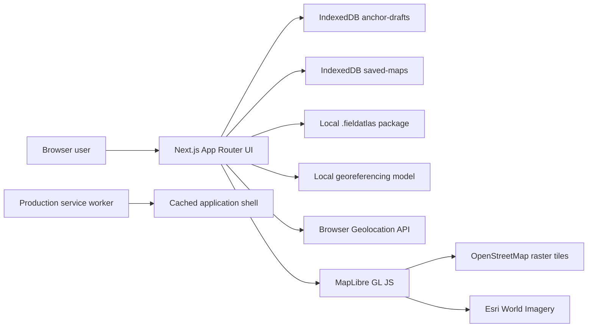
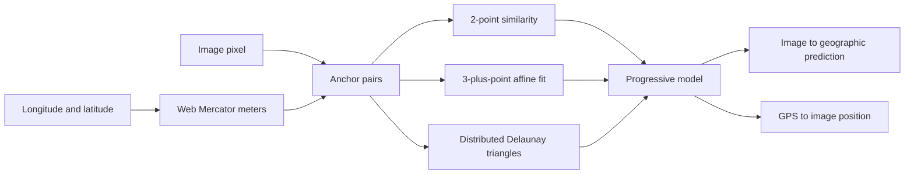

# Current architecture

Status: implemented local prototype  
Last reviewed: 2026-08-10

## System overview

There is currently no application API, account system, cloud object store, or server database. All user-created map content remains in the browser origin's IndexedDB database.

## Application routes

| Route | Main component | Responsibility |
| --- | --- | --- |
| `/` | `DiscoverExperience` | Sample catalog, search/filter, one-shot foreground location, distance ordering |
| `/anchor` | `AnchorWorkbench` | Resume or create the active draft and edit anchors |
| `/anchor/new` | `NewAnchorSession` | Warn before replacing the active draft and start a clean workspace |
| `/my-maps` | `MyMapsLibrary` | List, search, preview, view, compare, reopen, back up, or restore saved maps |
| `/maps/[mapId]` | `SavedMapViewer` | High-resolution raster viewer and ephemeral foreground GPS projection |
| `/maps/[mapId]/compare` | `SavedMapCompare` | Canvas-warped raster overlay synchronized with MapLibre |

The App Router page files are intentionally thin; feature modules own browser state and behavior.

## Feature boundaries

- `src/features/anchor`: file selection, target-image gestures, basemap interaction, anchor history, draft hydration/autosave, and 90-degree working-view rotation.
- `src/features/maps`: structured metadata, saved-map persistence, exact-source consolidation, and My Maps UI.
- `src/features/backup`: versioned package encoding/validation, SHA-256 asset deduplication, import conflict planning, atomic restore, and My Maps backup controls.
- `src/features/viewer`: saved-image pan/zoom, foreground geolocation watch, GPS-to-image projection, and accuracy visualization.
- `src/features/compare`: compare-mesh construction and triangle-by-triangle Canvas 2D rendering over MapLibre.
- `src/features/discover`: typed sample catalog, filters, distance calculations, and foreground location ordering.
- `src/lib/georeferencing`: Web Mercator conversion, similarity/affine fitting, Delaunay triangulation, forward/inverse projection, and quality warnings.
- `src/lib/local-database.ts`: IndexedDB database name, version, stores, and transaction helpers.

## Georeferencing pipeline

Each anchor pairs an original image pixel with longitude/latitude. Latitude/longitude is converted to Web Mercator meters before fitting.

- Fewer than two anchors: no GPS-ready transform.
- Two anchors: similarity transform determines translation, rotation, and uniform scale.
- Three or more suitable anchors: affine global fallback supports skew and nonuniform scale.
- Distributed anchors: piecewise-affine triangles correct local distortion in both directions.
- Duplicate, degenerate, and folded geometry produces quality warnings.

Editor rotation is display-only. Pointer coordinates and marker positions are converted to and from original image pixels, so rotation does not mutate saved anchors or the image Blob.

## Local persistence

The IndexedDB database is `field-atlas-local`, version 2:

- `anchor-drafts`: one record with key `current`.
- `saved-maps`: versioned named map records keyed by UUID.

Both stores retain native `Blob` values; image data is not base64-encoded. Writes use explicit IndexedDB transactions. Details are in [`DATA_AND_PRIVACY.md`](DATA_AND_PRIVACY.md).

## Portable backup pipeline

The `.fieldatlas` version 1 container starts with the `FATLAS01` magic header and a little-endian manifest length, followed by a UTF-8 JSON manifest and contiguous raw image payloads. SHA-256 IDs deduplicate images shared by a saved map and its active draft. Preview parsing validates record limits, numeric fields, payload ranges, and every checksum before import can begin.

Import planning is non-destructive: exact records are skipped; divergent records sharing an ID receive a new UUID, a visible imported-copy title, and lineage metadata. Confirmed changes use one read/write transaction across `saved-maps` and `anchor-drafts`, with the current draft retained unless replacement is explicitly selected. The full contract is in [`portable-backup.md`](portable-backup.md).

## Basemap and compare rendering

MapLibre supplies pan, zoom, and base-layer rendering. The default development style contains OSM Street and Esri Satellite raster sources. Hybrid draws a muted, partially transparent OSM layer over imagery.

Compare mode builds a mesh from the source image corners, a regular support grid, and all anchors. The georeference model projects every vertex. A transparent Canvas 2D overlay maps source triangles into MapLibre screen triangles during map rendering. This supports scale, rotation, skew, and local rubber-sheet distortion without uploading the source image.

## PWA and offline boundary

The service worker registers only in production. It precaches the home page, My Maps shell, offline document, and icon, then runtime-caches same-origin navigation and static assets. Saved map images remain in IndexedDB. Online basemap tiles are cross-origin and are not bulk-downloaded by this service worker. Offline map viewing therefore depends on both the saved IndexedDB record and an available/cached application route.

## Testing and validation

Vitest covers georeferencing math, Mercator conversion, basemap configuration, GPS projection, saved-map consolidation, backup package integrity/conflict planning, comparison mesh/render transforms, and view rotation. Repository validation commands are documented in [`../README.md`](../README.md#quality-commands).
