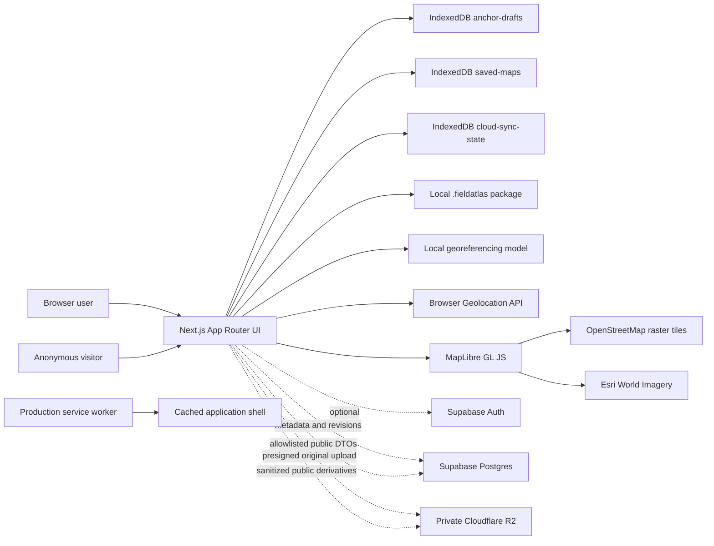
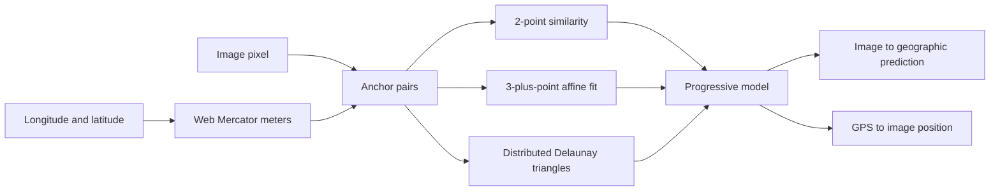

# Current architecture

Status: implemented local-first, account-gated creator beta with activated private sync and core community publishing
Last reviewed: 2026-08-15

## System overview

All core map behavior remains browser-local. When configured, App Router handlers add Supabase email authentication, RLS-protected metadata/revisions, and authorized presigned R2 image transfer. Missing cloud configuration does not disable or redirect any local route.

## Application routes

| Route | Main component | Responsibility |
| --- | --- | --- |
| `/` | `DiscoverExperience` | Public catalog with a loading state, sample fallback only when the community request fails, explicit fresh-catalog refresh, search/filter, one-shot foreground location, distance ordering |
| `/anchor` | `AnchorWorkbench` | Resume or create the active draft and edit anchors |
| `/anchor/new` | `NewAnchorSession` | Warn before replacing the active draft and start a clean workspace |
| `/my-maps` | `MyMapsLibrary` | List, search, preview, view, compare, reopen, back up, or restore saved maps |
| `/account` | `AccountPanel` | Email/password account, public profile settings, sign-out, and cloud-setup state |
| `/maps/[mapId]` | `SavedMapViewer` | Local, authorized-cloud, or authorized-public raster viewer, optional offline save, reports, and ephemeral GPS |
| `/maps/[mapId]/compare` | `SavedMapCompare` | Canvas-warped local, authorized-cloud, or public raster overlay synchronized with MapLibre |
| `/profiles/[username]` | `PublicProfile` | Anonymous public mapmaker page and effective-public contributions |
| `/moderation` | `ModerationConsole` | Staff-only post-publication and report queue |

The App Router page files are intentionally thin; feature modules own browser state and behavior.

The JSON and redirect handlers under `/api/cloud/*` and `/api/community/*` are cataloged in [`API_REFERENCE.md`](API_REFERENCE.md). They are a browser-application API, not a stable third-party public API.

## Feature boundaries

- `src/features/anchor`: file selection, target-image gestures, reciprocal forward/inverse hover previews, basemap interaction, anchor history, draft hydration/autosave, 90-degree working-view rotation, and folded-triangle diagnostics rendered in both panes.
- `src/features/maps`: structured metadata, saved-map persistence, exact-source consolidation, and My Maps UI with cloud publication-state labels and post-share refresh.
- `src/features/backup`: versioned package encoding/validation, SHA-256 asset deduplication, import conflict planning, atomic restore, and My Maps backup controls.
- `src/features/cloud`: upload validation, hashing, explicit private sync, immutable revision state, account map listing, and verified device download.
- `src/features/community`: explicit publishing, public/unlisted contracts, anonymous reports, profiles, Discover cards, and moderation UI.
- `src/features/viewer`: saved-image pan/zoom, foreground geolocation watch, GPS-to-image projection, and accuracy visualization.
- `src/features/compare`: compare-mesh construction and triangle-by-triangle Canvas 2D rendering over MapLibre.
- `src/features/discover`: public catalog integration with sample fallback, filters, distance calculations, and foreground location ordering.
- `src/lib/georeferencing`: Web Mercator conversion, similarity/affine fitting, Delaunay triangulation, forward/inverse projection, and quality warnings.
- `src/lib/local-database.ts`: IndexedDB database name, version, stores, and transaction helpers.
- `src/lib/supabase`, `src/lib/cloud`, and `src/lib/community`: cookie-based Supabase clients, API authorization, private sync DTOs, R2 transfer, image sanitization, publication CAS, and allowlisted public DTOs.

## Georeferencing pipeline

Each anchor pairs an original image pixel with longitude/latitude. Latitude/longitude is converted to Web Mercator meters before fitting.

- Fewer than two anchors: no GPS-ready transform.
- Two anchors: similarity transform determines translation, rotation, and uniform scale.
- Three or more suitable anchors: affine global fallback supports skew and nonuniform scale.
- Distributed anchors: piecewise-affine triangles correct local distortion in both directions.
- Duplicate, degenerate, and folded geometry produces quality warnings. Each folded warning retains the three anchor IDs that caused one triangle. Multiple warnings may share anchors; Anchor Lab maps the union of those IDs back to numbered markers, reports triangle count separately from unique anchor count, and draws each affected triangle on the uploaded image and basemap without changing saved data.

Editor rotation is display-only. Pointer coordinates and marker positions are converted to and from original image pixels, so rotation does not mutate saved anchors or the image Blob.

Anchor Lab hover previews use the same forward/inverse georeference model as GPS and prediction markers. A pointer over either pane produces a temporary red guide in the other pane; it never changes anchors or saved data.

## Local persistence

The IndexedDB database is `field-atlas-local`, version 3:

- `anchor-drafts`: one record with key `current`.
- `saved-maps`: versioned named map records keyed by UUID.
- `cloud-sync-state`: the last accepted server revision/fingerprint and the local map timestamp that produced it for each explicitly synced local map. The timestamp acknowledgement prevents an idempotent content match from being shown as unsynced merely because a local save touched the record timestamp.

Both stores retain native `Blob` values; image data is not base64-encoded. Writes use explicit IndexedDB transactions. Details are in [`DATA_AND_PRIVACY.md`](DATA_AND_PRIVACY.md).

## Optional cloud pipeline

Account sessions use Supabase SSR cookies refreshed by the Next.js 16 `proxy.ts` convention. Every mutation re-verifies authentication/authorization close to the data source. Postgres RLS permits owners to select their records. Anonymous users cannot select raw maps, revisions, private assets, reports, roles, or unlisted records; allowlisted security-definer functions return only effective public DTOs.

The client hashes the original Blob, asks the server for a five-minute content-type-restricted R2 `PUT` URL, uploads directly, and completes the asset only after a server-side `HEAD` size/type check. A map is sent only when the creator finishes it or explicitly chooses a cloud checkpoint; local autosaves do not upload each anchor. Sync then creates an immutable revision, or returns an idempotent unchanged result when the content fingerprint already matches. The client records the local timestamp acknowledged by that revision so timestamp-only local saves do not produce a false unsynced warning. The Share dialog can invoke the same explicit checkpoint callback and refresh publication status after it succeeds. A stale base revision is preserved as a conflict and does not replace the remote current revision. Downloads are authorized through a short-lived `GET` URL and checksum-verified before a cloud-only record is inserted into IndexedDB. Public viewers treat an unavailable private-cloud detail response as an absent private copy and continue to the authorized public publication endpoint, so anonymous viewing does not depend on private cloud configuration.

The additive community migration adds immutable publication records, exact revision isolation, revocable Unlisted capability hashes, map-level moderation holds, anonymous reports, generated profiles, roles, and an append-only action log. Publishing downloads the verified private source server-side, rechecks its checksum, decodes it with bounded pixels, rotates from metadata, and writes immutable sanitized WebP map/thumbnail objects before atomically advancing `current_publication_id`. The owner UI compares the current cloud revision with the effective publication and labels an older public snapshot before offering **Update public map**. Updating creates a new immutable publication while retaining the prior record for history and rollback. An exact current revision plus identical sharing fields is rejected before the source image is read, preventing duplicate R2 derivatives while retaining idempotent retry recovery. See [`cloud-sync-foundation.md`](cloud-sync-foundation.md), [`community-publishing-foundation.md`](community-publishing-foundation.md), [`publication-deduplication.md`](publication-deduplication.md), and [`CLOUD_SETUP.md`](CLOUD_SETUP.md).

## Portable backup pipeline

The `.fieldatlas` version 1 container starts with the `FATLAS01` magic header and a little-endian manifest length, followed by a UTF-8 JSON manifest and contiguous raw image payloads. SHA-256 IDs deduplicate images shared by a saved map and its active draft. Preview parsing validates record limits, numeric fields, payload ranges, and every checksum before import can begin.

Import planning is non-destructive: exact records are skipped; divergent records sharing an ID receive a new UUID, a visible imported-copy title, and lineage metadata. Confirmed changes use one read/write transaction across `saved-maps` and `anchor-drafts`, with the current draft retained unless replacement is explicitly selected. The full contract is in [`portable-backup.md`](portable-backup.md).

## Basemap and compare rendering

MapLibre supplies pan, zoom, and base-layer rendering. The default development style contains OSM Street and Esri Satellite raster sources. Hybrid draws a muted, partially transparent OSM layer over imagery.

Compare mode builds a mesh from the source image corners, a regular support grid, and all anchors. The georeference model projects every vertex. A transparent Canvas 2D overlay maps source triangles into MapLibre screen triangles during map rendering. This supports scale, rotation, skew, and local rubber-sheet distortion without uploading the source image.

## PWA and offline boundary

The service worker registers only in production. It precaches the home page, My Maps shell, offline document, and icon, then runtime-caches same-origin navigation and static assets. Saved map images remain in IndexedDB. Online basemap tiles are cross-origin and are not bulk-downloaded by this service worker. Offline map viewing therefore depends on both the saved IndexedDB record and an available/cached application route.

## Testing and validation

Vitest covers georeferencing math, Mercator conversion, basemap configuration, GPS projection, saved-map consolidation, backup package integrity/conflict planning, comparison mesh/render transforms, view rotation, cloud payloads, community contracts, and unchanged-publication matching. Repository validation and release commands are documented in [`../README.md`](../README.md#quality-commands) and [`OPERATIONS.md`](OPERATIONS.md).
