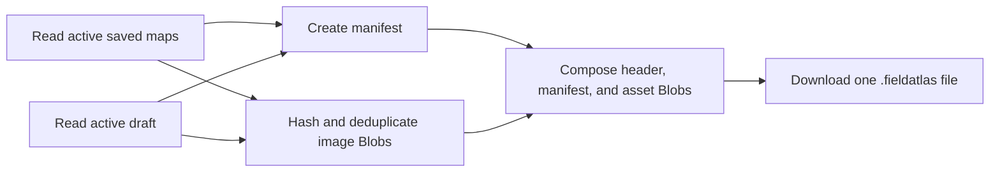

# Portable backup and restore

Status: implemented and browser-verified
Last reviewed: 2026-08-10

## Understanding summary

- One portable backup must protect every active My Maps record plus the unfinished Anchor Lab draft, if one exists.
- The purpose is recovery from browser-profile loss, site-data clearing, or movement to another browser before accounts and cloud synchronization exist.
- Original image bytes, structured metadata, anchors, stable IDs, timestamps, and relevant editor state must survive a round trip.
- Backup and restore remain entirely local and require neither an account nor a network request.
- Import must never silently delete, overwrite, or reduce existing work.
- Corrupt, unsupported, or incomplete packages must leave IndexedDB unchanged.
- The format should map cleanly to future account-based online records and image assets.

## Assumptions and non-functional requirements

- Initial scale is dozens of maps and potentially a few hundred megabytes of original images.
- Images are never resized or recompressed during backup.
- Blob composition and slicing are used to avoid base64 expansion and unnecessary full-package copies.
- Package verification may take noticeable time for large images, so progress and disabled busy controls are required.
- GPS readings and location history are not part of the backup because the application does not persist them.
- The package can contain private images and should be described as sensitive user data.
- Version 1 remains dependency-light and maintainable by the current small project.
- Server authentication, cloud storage, synchronization, and public sharing are separate phases.

## Approaches considered

### 1. Versioned binary `.fieldatlas` package - selected

Store a compact JSON manifest followed by raw image bytes. This preserves quality, avoids base64 expansion, supports Blob slices, needs no archive dependency, and gives Field Atlas full schema-version control.

### 2. ZIP package

ZIP would be manually inspectable but adds a compression/archive dependency and memory overhead. JPEG, WebP, and HEIC images usually gain little from another compression layer.

### 3. Base64 JSON

One JSON document would be conceptually simple, but base64 increases image storage by about one third and creates expensive large strings. It is unsuitable for high-resolution collections.

## Package format version 1

The physical file layout is:

1. Eight ASCII magic bytes: `FATLAS01`.
2. One unsigned 32-bit little-endian manifest byte length.
3. One UTF-8 JSON manifest.
4. Concatenated raw asset payloads.

The manifest contains:

- format and schema versions;
- export timestamp and application version;
- saved-map records without inline Blob values;
- an optional active-draft record without an inline Blob value;
- an asset table containing stable SHA-256 ID, MIME type, byte length, and payload-relative offset; and
- references from maps/draft to asset IDs.

SHA-256 asset IDs deduplicate one original image used by both a finished map and the active draft. Offsets are relative to the payload start. The decoder checks finite safe integers, non-overlapping in-bounds ranges, declared lengths, allowed record shapes, supported MIME values, and hashes before any write.

The package name follows `field-atlas-backup-YYYY-MM-DD.fieldatlas`. Export reads storage only and does not update map or draft timestamps.

## Export data flow

Only active/canonical My Maps records are exported. Superseded recovery records remain in IndexedDB but are not multiplied into routine backups. The canonical record already carries merged unique anchors. The active draft is exported even when linked to one of those maps.

## Import preview and validation

Selecting a file performs a read-only parse. The preview reports:

- package date and supported version;
- map titles and anchor counts;
- number and total bytes of image assets;
- whether an active draft is present; and
- counts of new, identical, and conflicting records.

Malformed headers, oversized manifests, bad JSON, unsupported schema versions, duplicate manifest IDs, invalid coordinates/dimensions, out-of-bounds or overlapping assets, length mismatches, checksum failures, and unacceptable record counts stop at preview. Canceling makes no changes.

## Conflict behavior

Saved maps are planned before writing:

- If no record uses the imported ID, restore the original ID and timestamps.
- If the ID and logical contents match, skip the imported record as already present.
- If the ID exists with different contents, preserve both. Assign the incoming record a new UUID, append ` (Imported copy)` to its title, and retain an optional import-lineage reference to the original ID.
- Mark intentional imported conflicts so exact-source recovery consolidation does not hide or merge the visible copy later.
- Never reduce an existing anchor set or delete a record.

If the package has a draft and the browser has none, restore it. If a draft already exists, **Keep my current draft** is the default. Replacing it requires an explicit option and confirmation displaying both filenames and anchor counts.

## Atomic write

After confirmation, open one IndexedDB read/write transaction spanning `saved-maps` and, when needed, `anchor-drafts`. Re-check IDs inside the transaction, apply the precomputed plan, and abort on any unexpected state or failed write. A failure leaves both stores unchanged. Success reloads My Maps and reports imported, copied, skipped, and unchanged counts.

## Interface

My Maps gains a **Protect your maps** section near its current local-storage warning.

- **Back up all maps** exports the complete package.
- **Import backup** accepts `.fieldatlas` files and opens the preview.
- Export, verification, and import expose accessible progress/status messages and disable overlapping actions.
- The browser may show the last successful export time as a convenience, but the copy must not claim that the downloaded file still exists.
- The confirmation label describes the exact operation, such as **Import 3 maps and keep current draft**.

## Future online storage boundary

The manifest deliberately mirrors future server entities: maps, image assets, metadata, anchors, IDs, timestamps, and draft state remain separate. A later authenticated API can reuse validated transfer objects while replacing payload offsets with uploaded object references.

Cloud work still requires independent decisions for authentication, ownership, private/public authorization, storage quotas, resumable uploads, synchronization, remote revisions, and conflicts. Version 1 backup does not pretend to provide those guarantees.

## Error handling and security

- Treat imported text and filenames as data, never executable markup.
- Accept only the versioned package header and validated record schema.
- Validate image MIME and decode only when displayed by the existing image UI.
- Bound manifest size, record counts, asset counts, and every numeric field before allocation.
- Show actionable errors without including image contents or private metadata in console logs.
- Never include GPS readings, browsing history, or secrets.

## Verification status

### Automated package tests

- Encode/decode round trips cover Unicode metadata, a saved map plus linked draft, shared-asset deduplication, and exact restored bytes.
- Invalid headers, truncated payloads, and checksum corruption are rejected before import.
- Structural validation also bounds manifests, record counts, coordinates, dimensions, offsets, MIME values, and contiguous payload layout.
- Draft links are remapped to the visible consolidated map during export, and packages with dangling saved-map references are rejected.

### Automated import-planning tests

- New records preserve their IDs and linked draft references.
- Exact duplicates are skipped.
- Same-ID conflicts receive a new UUID, visible imported-copy marker, and repeat-import lineage protection.
- Preview exposes incoming and current draft information; replacement remains an explicit UI choice.

### Browser QA completed 2026-08-10

- A read-only export of the real three-map library reported all three maps and its active draft without changing IndexedDB.
- An isolated `localhost:3001` database previewed and restored a generated package, then recognized the same package as already present on repeat import.
- Existing-draft replacement stayed unchecked by default and enabled an exact replacement action only when selected.
- The 390-pixel mobile preview remained inside the viewport with no horizontal document overflow.
- Browser logs contained no warnings or errors during the verified flow.

Further hardening should add direct IndexedDB transaction-abort integration coverage and large-collection performance fixtures before the public beta.

## Decision log

- **B-001 - Complete local protection:** include active My Maps records and the active unfinished draft.
- **B-002 - Custom binary container:** use `.fieldatlas` with a JSON manifest and raw assets.
- **B-003 - Preserve image quality:** store exact original bytes with no resize or recompression.
- **B-004 - Deduplicate package assets:** identify identical images by SHA-256.
- **B-005 - Validate before writes:** complete structural and checksum validation during preview.
- **B-006 - Atomic import:** write both IndexedDB stores in one transaction.
- **B-007 - Preserve conflicts:** skip identical records but keep divergent same-ID maps as visible imported copies.
- **B-008 - Protect the active draft:** keep the current draft unless replacement is explicitly confirmed.
- **B-009 - Dependency-light version 1:** do not add ZIP/compression solely for backup.
- **B-010 - Cloud-compatible records:** keep package entities aligned with the future authenticated storage model.
